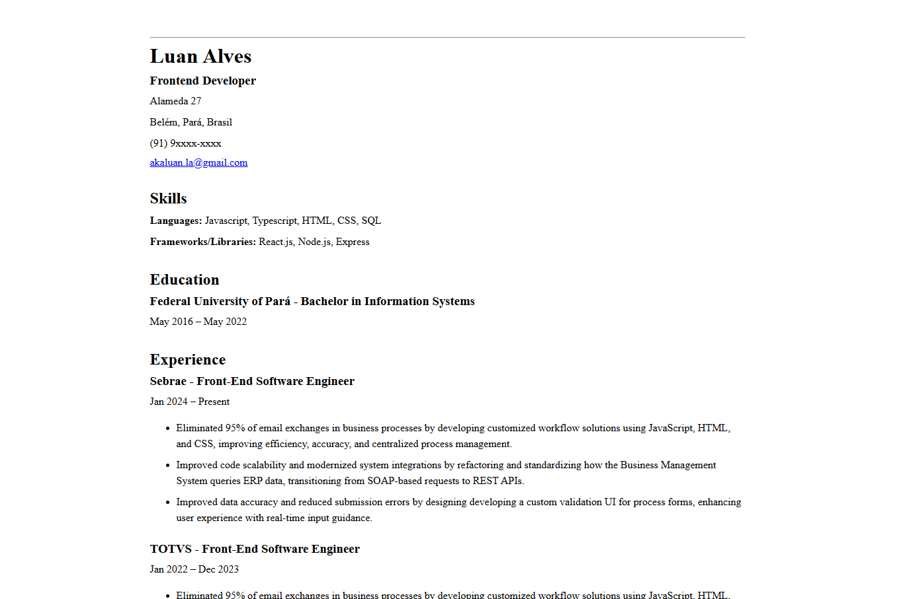

# 📄 Single-Page CV

This is a simple, responsive, single-page CV built with HTML and CSS.  
It’s the first project in my **Frontend Developer Roadmap** journey from [roadmap.sh](https://roadmap.sh/frontend).

## 🛠️ Technologies Used

- HTML5
- CSS3

## 🎯 Features

- Clean and minimal design
- Responsive layout for desktop and mobile
- Sections include:
  - About Me
  - Skills
  - Experience
  - Projects
  - Contact

## 📸 Preview

## 🧠 What I Learned

- SEO Meta Tags
- Open Graph Tags

---

## 📚 Part of:

[🗂 roadmap.sh-projects](https://github.com/aka-luan/roadmap.sh-projects)
